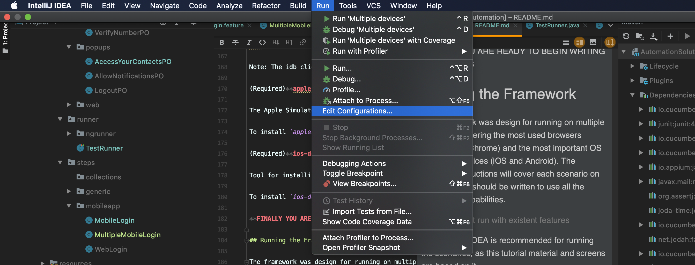
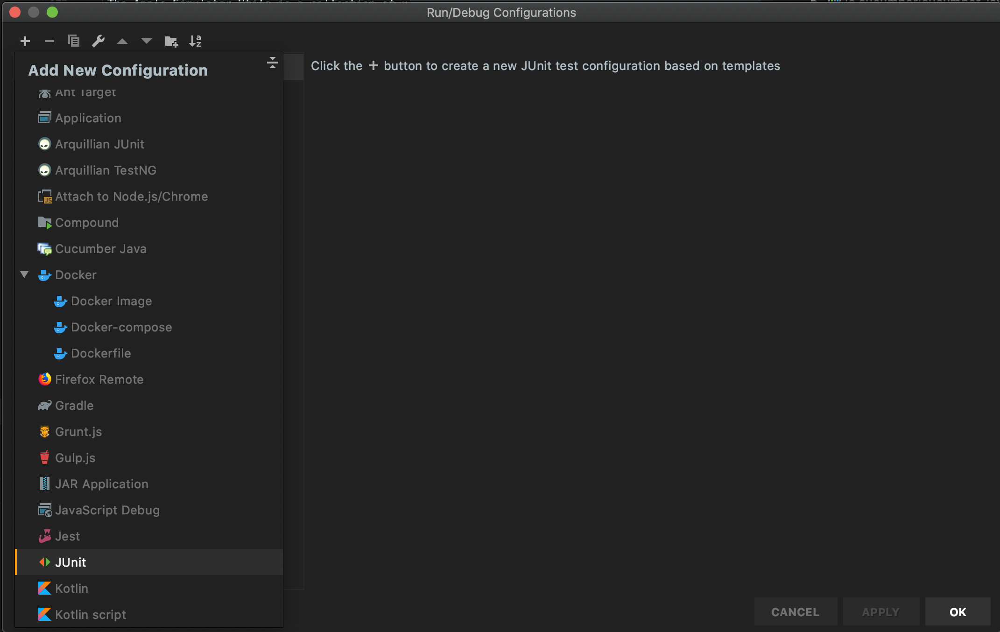
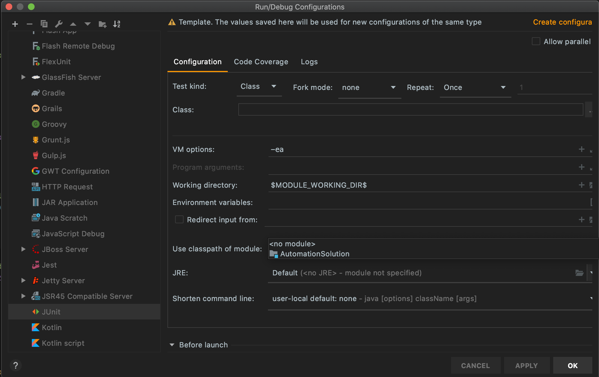
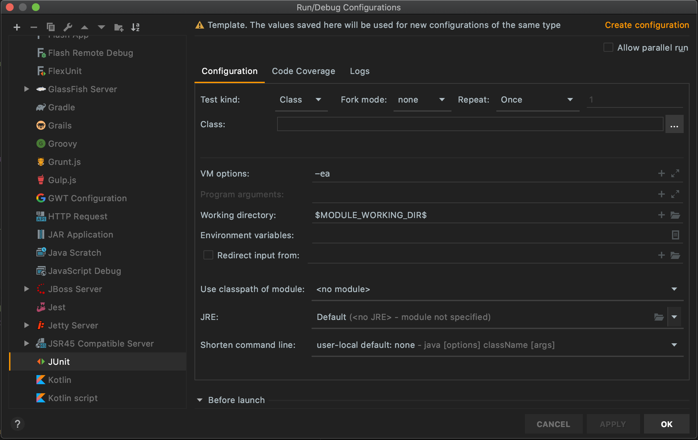
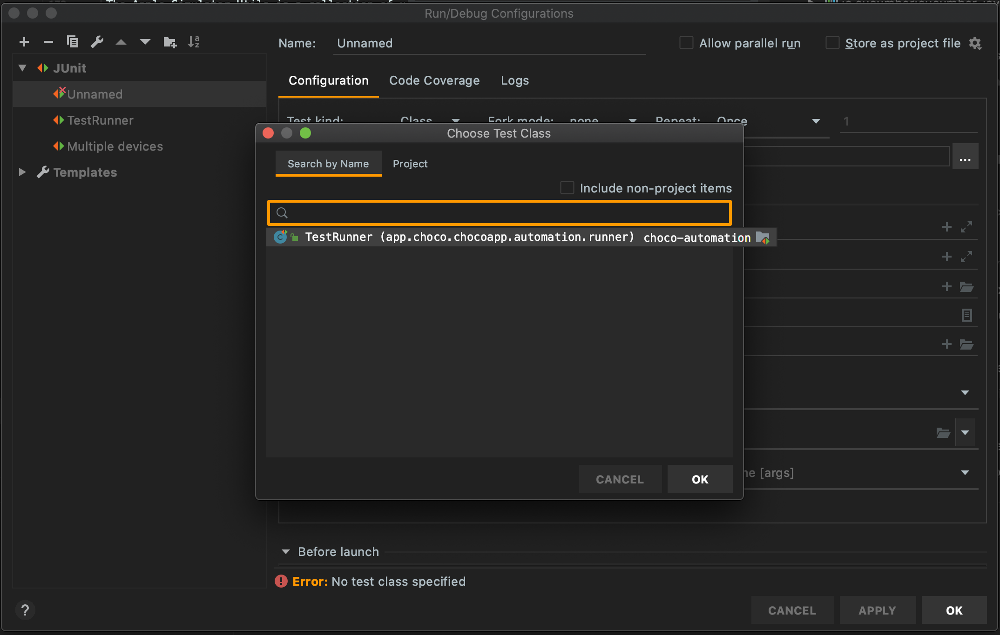
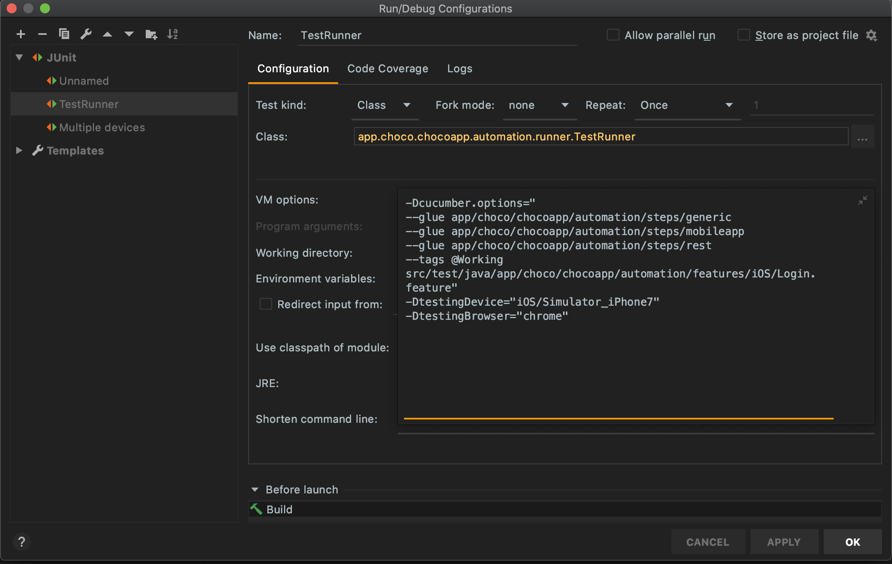
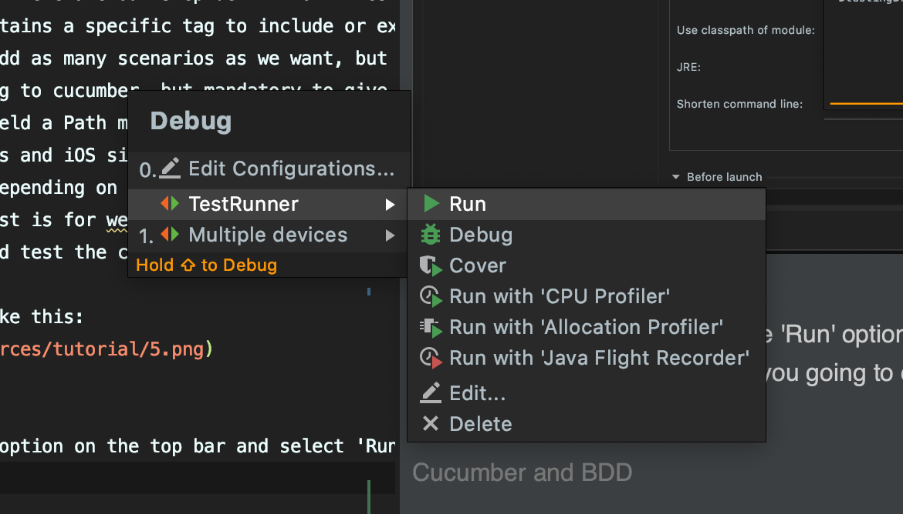

# Yunar technical test

Before you can run please make sure to download the following SDK for iOS:
 * 11.4
 * 12.4
 * 13.4
 
 And for Android please create the following emulators: 
 * Pixel API 23
 * Pixel2 API 24
 * Pixel2 API 26
 * Pixel2 API 28
 * Pixel3 API 29
 
These are the following commands to be able to run each scenario on the proper device, on the terminal please go to the project root folder and execute on of the following commands

*ANDROID*
```
mvn clean test -Dcucumber.options="--glue gmbh/ambidexter/automation/steps  src/test/java/gmbh/ambidexter/automation/features/android/Android_TestApp.feature"
               -DtestingDevice="android/Simulator_GooglePixel(Android6)"
```
```
mvn clean test -Dcucumber.options="--glue gmbh/ambidexter/automation/steps  src/test/java/gmbh/ambidexter/automation/features/android/Android_TestApp.feature"
               -DtestingDevice="android/Simulator_GooglePixel2(Android7)"
```
```
mvn clean test -Dcucumber.options="--glue gmbh/ambidexter/automation/steps  src/test/java/gmbh/ambidexter/automation/features/android/Android_TestApp.feature"
               -DtestingDevice="android/Simulator_GooglePixel2(Android8)"
```
```
mvn clean test -Dcucumber.options="--glue gmbh/ambidexter/automation/steps  src/test/java/gmbh/ambidexter/automation/features/android/Android_TestApp.feature"
               -DtestingDevice="android/Simulator_GooglePixel2(Android9)"
```
```            
mvn clean test -Dcucumber.options="--glue gmbh/ambidexter/automation/steps  src/test/java/gmbh/ambidexter/automation/features/android/Android_TestApp.feature"
               -DtestingDevice="android/Simulator_GooglePixel3(Android10)"
```
*IOS*
```
mvn clean test -Dcucumber.options="--glue gmbh/ambidexter/automation/steps  src/test/java/gmbh/ambidexter/automation/features/iOS/iOS_TestApp.feature"
               -DtestingDevice="iOS/Simulator_iPhone8"
```
```
mvn clean test -Dcucumber.options="--glue gmbh/ambidexter/automation/steps  src/test/java/gmbh/ambidexter/automation/features/iOS/iOS_TestApp.feature"
               -DtestingDevice="iOS/Simulator_iPhoneX"
```
```
mvn clean test -Dcucumber.options="--glue gmbh/ambidexter/automation/steps  src/test/java/gmbh/ambidexter/automation/features/iOS/iOS_TestApp.feature"
               -DtestingDevice="iOS/Simulator_iPhone11"
```

###### Creating a test run with existent features
*Note:* IntelliJ IDEA is recommended for running the scenarios, as this tutorial material and screens are based on it.

First on your main IntelliJ window click on the 'Run' option located in the top bar and then click on 'Configurations...'


On the configuration window, locate the JUnit on the side bar and click on the '+' mark to add a new JUnit configuration


On the new JUnit configuration screen make sure the proper module is selected under the 'Use classpath of module' field


Now click on the '...' on the 'Class' field and select our Junit Runner class



Finally, click on the 'VM options' and then you will be able to input the parameters to configure the execution of any developed feature,
just make sure to differentiate between the built-in cucumber parameters and the custom ones, just follow these recommendations.
1. Always start with _-Dcucumber.options="..."_, it tells IntelliJ that we are running a Cucumber feature, and all the parameters inside from cucumber itself.
    * **--glue :** Path that tells cucumber where are our step definition files. Is important to include all the folders where our step-definition files are to allow cucumber to access the code from our feature file.
    * **--tags :** If the feature files contains a specific tag to include or exclude certain scenarios is mandatory to add this parameter.  
    * **path to the feature file** We can add as many scenarios as we want, but separate paths must be given to each one.
2. There are custom parameters not belonging to cucumber, but mandatory to give the test run more flexibility and give the tester more power to customize the test run.
    * **-DtestingDevice="...":** In this field a Path must be given. On the JSonConfig folder on the project there is a collection of json files which contains a collection of 
    capabilities to enable Android emulators and iOS simulators (and real devices too) for Appium to run and instantiate different 
    devices with different configurations depending on the needs of the test run.
    * **-DtestingBrowser="...":** If our test is for web, the name of the browser must be given in this field, to enable Selenium 
    instantiate the corresponding driver and test the corresponding browser. 'chrome' , 'firefox' and 'safari' are the accepted values for this field.

Finally, our configuration run must look like this: 

 Just give it a name and save it.
 
 Now to run it, just go again to the 'Run' option on the top bar and select 'Run' or 'Debug' depending on what are you going to do and selected the created configuration.

 
###### Cucumber and BDD
The framework uses BDD to write test cases, if you are not familiar neither Cucumber or BDD go through [this documentarion](https://cucumber.io/blog/2017/05/15/intro-to-bdd-and-tdd) about Gherkin and how BDD works.

# Java Automation Framework

It uses Java as main language, [Selenium WebDriver](http://www.seleniumhq.org) for Web testing, [Appium](http://appium.io) for Mobile testing and [RestAssured](http://rest-assured.io) for API testing. It supports multiple browsers, mobile simulators and real devices for test automation.

## Prerequisites

### For MAC
#### Download Java SDK
The recommendation is to have installed Java 8 on your machine, simply got to the [Java SE download page](http://www.oracle.com/technetwork/java/javase/downloads/jdk8-downloads-2133151.html) download and install the java version according to your OS.

##### Setting JAVA_HOME

Then you need to set up the JAVA_HOME environment variable on your machine. 
To do this open your terminal and open your .bash_profile if you use bash or .zshrc if you use zsh file, using nano or vi.

`nano .bash_profile`

or

`nano .zshrc`

add this lines 

```
export JAVA_HOME=/Library/Java/JavaVirtualMachines/jdk[your java version].jdk/Contents/Home
export PATH=$PATH:$JAVA_HOME/bin
```

save and exit the editor and finally recompile your bash file using 

`source ~/.bash_profile` 

or 

`source ~/.zshrc` on your terminal. 

To check if this was successful on your terminal write `echo $JAVA_HOME` and if it worked, you should read the path where your sdk is located. 

#### INSTALLING XCODE
For running iOS mobile testing, you need to have Xcode, it has all the iOS SDK's for configure and running simulators such as iPhones and iPads.

Installing this is quite simple, just go to the App Store on your mac search [Xcode](https://itunes.apple.com/pe/app/xcode/id497799835?mt=12) and just click on the install button. 

#### INSTALLING ANDROID STUDIO
For running Android mobile test you need to have the Android Studio installed on your machine to manage all the simulators, configurations and installations for Android devices.
You may to follow [these instructions](https://developer.android.com/studio/install.html) to install it.
##### Setting ANDROID_HOME
After you install the Android SDK you must set up the ANDROID_HOME environment variable along others finish the installation.

To do so, open your terminal and open your bash profile as you did when setting JAVA_HOME.
On your .bash_profile or .zshrc paste the following lines

```
export ANDROID_HOME=/Users/[your user]/Library/Android/sdk
export PATH="$PATH:$ANDROID_HOME/tools"
export PATH="$PATH:$ANDROID_HOME/platform-tools"
export PATH="$PATH:$ANDROID_HOME/platform-tools/adb"
export PATH="$PATH:$ANDROID_HOME/build-tools"
```

To finalize, again recompile your bash file using `source ~/.bash_profile` or or `source ~/.zshrc` command. Now you are fully set.

##### Setting Android Virtual Devices
After the previous steps are completed you must configure at least one simulator, and for doing so, please follow [this instructions](https://developer.android.com/studio/run/managing-avds.html) on how to create and mange Android Virtual Devices.

## Working Platforms
* **Working OS**
    * Windows
    * MAC
    
* **Working Browsers**
    * Chrome
    * Mozilla Firefox
    * Safari (Mac Only)
    
* **Working Mobile Devices OS**
    * iOS (Mac Only)
    * Android
    
## Requirements

### MAC
 Previous all installations, if you are only automating Web tests you only need to have the latest versions of Mozilla and Chrome Browsers on your MAC, you may want to jump to the writing your test scripts section, but if you are running mobile tests, please keep reading forward.

 The environment needs certain software to be previously installed before you are able to run the framework.
 
#### INSTALLING NODE AND NPM

If you have homebrew installed on your machine this should be quite easy if not, open your terminal on your mac and copy-paste this line on the command prompt

```
/usr/bin/ruby -e "$(curl -fsSL https://raw.githubusercontent.com/Homebrew/install/master/install)"
```

This will install homebrew on your machine, now you are ready to install node.

If you don't want to use homebrew, you can always go to the [Node.js Downloads page](https://nodejs.org/en/download/), select the macOS installer and run the .pkg file.

Now for installing node simply on the command prompt write 

```
brew install node
```

If you want to check te installation of both tools put on the Terminal `node -v` to check which version of node is installed, or `npm -v` if you want to check the npm version. For updating node and npm first update the homebrew packages typing `brew update` and then type `brew upgrade node`, you are running the latest version of node and npm on your machine.

#### INSTALLING APPIUM

For installing Appium just open a Terminal and put

```
npm install -g appium
```

This will install the latest version of Appium. If you want to download the Desktop version go to the the[releases page](https://github.com/appium/appium-desktop/releases)directly and download it.

#### INSTALLING CARTHAGE
For iOS mobile testing you must have carthage installed, if you want to know more about carthage please[read this](https://github.com/Carthage/Carthage).

There are multiple options for installing Carthage:

**Installer:** Download and run the `Carthage.pkg` file for the latest [release](https://github.com/Carthage/Carthage/releases), then follow the on-screen instructions.

**Homebrew:** You can use [Homebrew](http://brew.sh) and install the `carthage` tool on your system simply by running `brew update` and `brew install carthage`. (note: if you previously installed the binary version of Carthage, you should delete `/Library/Frameworks/CarthageKit.framework`).

**ADDITIONAL CONFIGURATION**

As some tests require specific gps location and image based comparison tests, additional components need to be installed to be able to use the framework full potential

##### Image based comparison components

(Required)**opencv4nodejs**

This is a nodejs library that allows appium to use native OpenCV for image operations such as face recognition, face detection and image comparison through different matching algorithms. For more information please refer to [this link](https://docs.opencv.org/3.0-beta/index.html)

To install the `opencv4nodejs` on your system, please run `npm i -g opencv4nodejs`.

(Optional) **ffmpeg & mjpeg-consumer**

This library is used mainly with appium to capture video recordings with sound. But it has many other functions. For more information please refer to [this link](https://ffmpeg.org/)

To install the `ffmpeg` on your system, please run `brew update` and `brew install ffmpeg`.

To install the `mjpeg-consumer` on your system, please run `npm i -g mjpeg-consumer`.

(Required)**opencv4nodejs**

This is a nodejs library that allows appium to use native OpenCV for image operations such as face recognition, face detection and image comparison through different matching algorithms. For more information please refer to [this link](https://docs.opencv.org/3.0-beta/index.html)

To install the `opencv4nodejs` on your system, please run `npm i -g opencv4nodejs`.

##### Libraries for iOS

(Required)**set-simulator-location**

This is a simple CLI for easily setting the location of the currently running iOS Simulator. For information please refer to [this link](https://github.com/lyft/set-simulator-location)

To install the `set-simulator-location` on your system, please run `brew update` and `brew install lyft/formulae/set-simulator-location`.

(Required)**idb & idb-companion**

idb stands for iOS Development Bridge which provides a command line interface to automate iOS Simulators and Devices. For further information please refer to [this link](https://github.com/facebook/idb/blob/master/README.md)

To install `idb & idb-companion` on your system, please run `brew update` followed by `brew tap facebook/fb` and then `brew install idb-companion`

Also the idb client needs to be installed via pip `pip[pip version higher than 3.6] install fb-idb`

Note: The idb client requires python 3.6 or greater to be installed. Instruction how to install pip can be found [here](https://pip.pypa.io/en/stable/installing/)

(Required)**applesimutils**

The Apple Simulator Utils is a collection of utils for Apple simulator handling. 

To install `applesimutils` on your system, please run `brew update` followed by `brew tap wix/brew` and then `brew install applesimutils`

(Required)**ios-deploy**

Tool for installing and debugging iOS apps from the command line without using XCode. For further information please refer to [this link](https://github.com/ios-control/ios-deploy)  

To install `ios-deploy` on your system, please run `brew update` and then `brew install ios-deploy`

**FINALLY YOU ARE READY TO BEGIN WRITING YOUR TESTS**
 
## Running the Framework

The framework was design for running on multiple platforms, covering the most used browsers (Mozilla and Chrome) and the most important OS for mobile devices (iOS and Android).
The following instructions will cover each scenario on how the tests should be written to use all the framework capabilities.

###### Cucumber and BDD
The framework uses BDD to write test cases, if you are not familiar neither Cucumber or BDD go through [this documentarion](https://cucumber.io/blog/2017/05/15/intro-to-bdd-and-tdd) about Gherkin and how BDD works.